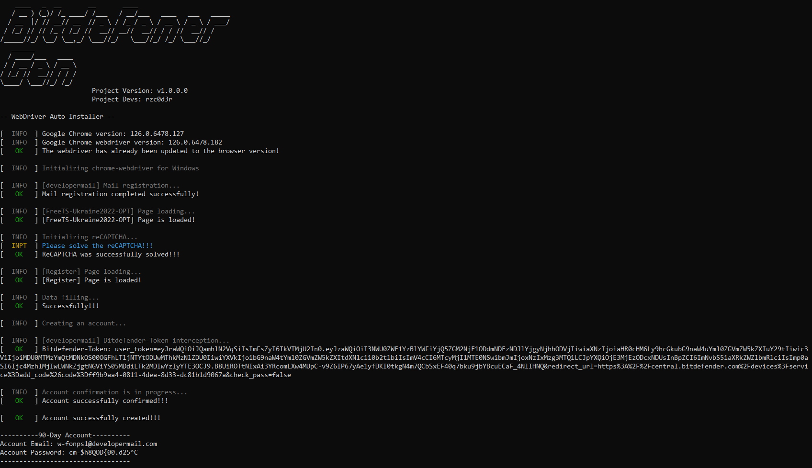
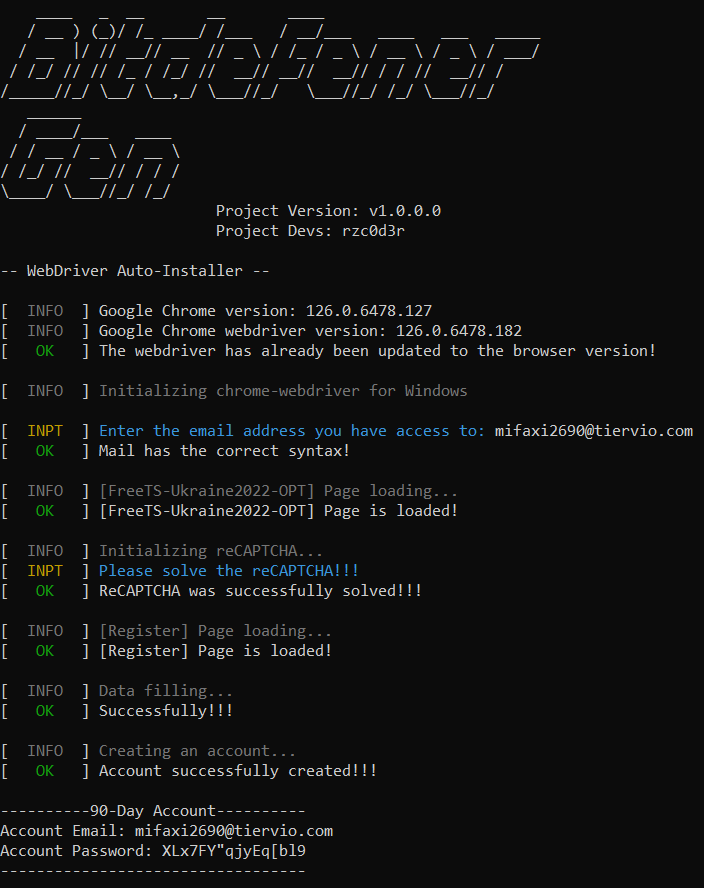
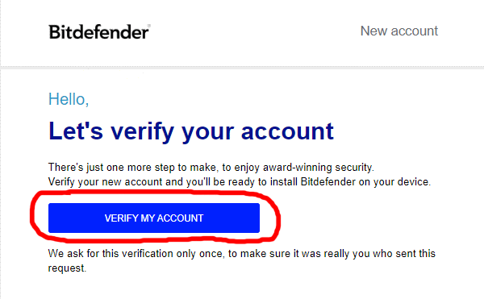
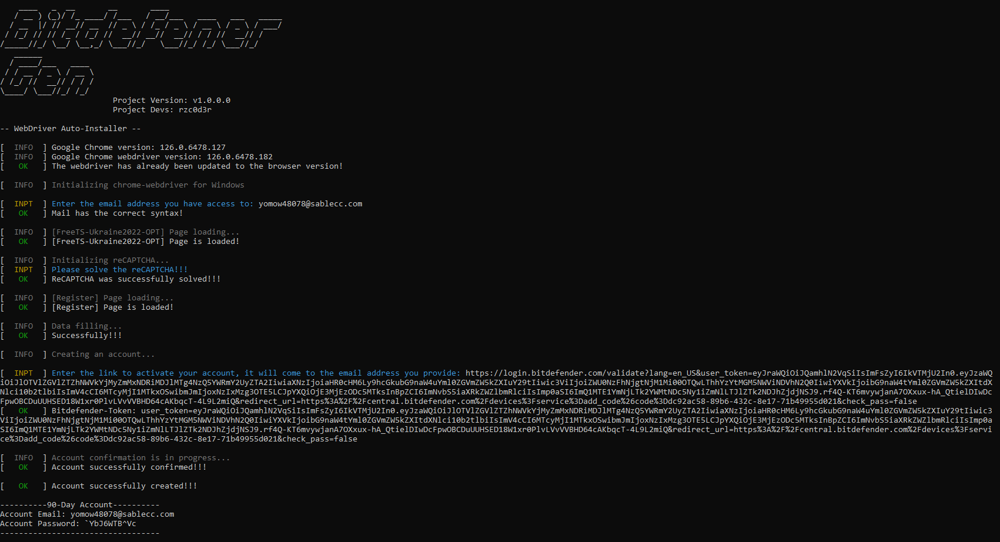

## Generation using implemented email APIs
  
1. Run **main.py** or executable file in Console or use [MBCI](MBCI-Inferface.md):
   ```
   python main.py --chrome --account
   ```
   ```
   BitdefenderGen_v1.0.1.0_win64.exe --chrome --account
   ```
   > File name is unique for each version! Do not copy the above command. This is an example!

2. Wait until you see in the console **Please solve reCAPTCHA!!!** then solve captcha!
   > Sometimes the captcha can be solved automatically!

3. Wait until you will see the account data
   > This information will also be written to a file named "Today date - BITDEFENDER ACCOUNTS.txt"

   

   ---

   ## Also, if you generate accounts frequently, the site may require email confirmation (program will do this automatically!)

   

---

## 2. Generation using your email provider
  
1. Run **main.py** or executable file in Console or use [MBCI](MBCI-Inferface.md):
   ```
   python main.py --chrome --account --custom-email-api
   ```
   ```
   BitdefenderGen_v1.0.1.0_win64.exe --chrome --account --custom-email-api
   ```
   > File name is unique for each version! Do not copy the above command. This is an example!
2. Enter the email address to which you have access.
3. Wait until you see in the console **Please solve reCAPTCHA!!!** then solve captcha!
   > Sometimes the captcha can be solved automatically!
4. Wait until you will see the account data
   > This information will also be written to a file named "Today date - BITDEFENDER ACCOUNTS.txt"
  
   
   
   ---

   ## Also, if you generate accounts frequently, the site may require email confirmation
   3.1. After some time in the console you will see the message **Enter the link to activate your account, it will come to the email address you provide**, here you need to go to your email and find mail in inbox (**you will have to wait**)

   **FROM: no-reply@info.bitdefender.com**

   **SUBJECT: Confirm email address**
   
   

   3.2. Then open that email and copy the link that is in the button (right click on the button, copy link address) and paste it into the console. If you have done everything correctly, the generation will complete successfully!
   
   
