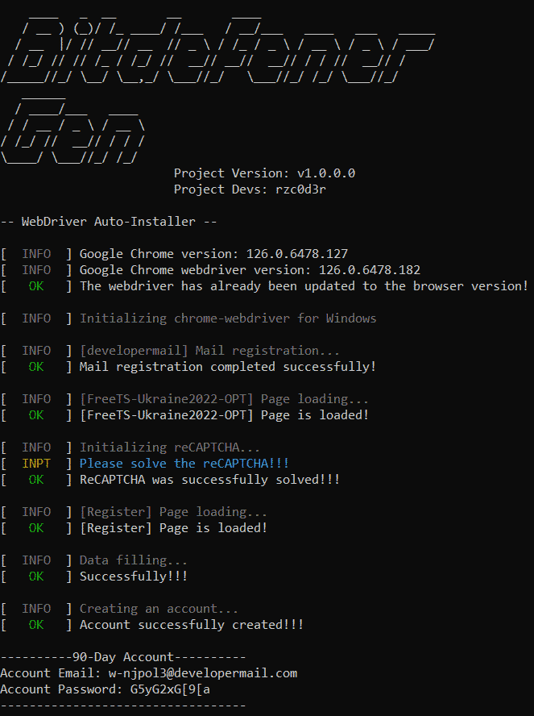

## Generation using implemented email APIs (Auto method, but less stable)
  
1. Run **main.py** or executable file in Console or use [MBCI](MBCI-Inferface.md):
  ```
  python main.py --chrome
  ```
  ```
  BitdefenderGen_v1.0.0.0_win64.exe --chrome
  ```
> File name is unique for each version! Do not copy the above command. This is an example!

2. Wait until you will see the account data
> This information will also be written to a file named "Today date - BITDEFENDER ACCOUNTS.txt"



---

## 2. Generation using your email provider (Totally manual method, but hyper stable)
  
1. Run **main.py** or executable file in Console or use [MBCI](MBCI-Inferface.md):
```
python main.py --chrome
```
```
BitdefenderGen_v1.0.0.0_win64.exe --chrome
```
> File name is unique for each version! Do not copy the above command. This is an example!

2. Wait until you will see the account data
> This information will also be written to a file named "Today date - BITDEFENDER ACCOUNTS.txt"
